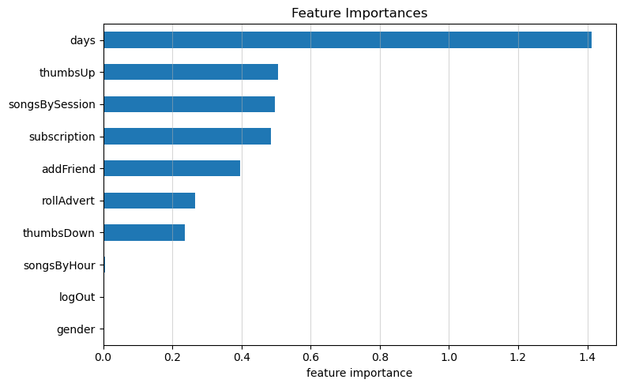

# Sparkify: Predicting User Churn Rate

This project investigates a dataset that contains logs of user interactions with a music service provider called Sparkify (an artificial firm). The target is to predict whether a user will churn or stay with the service. We will utilize interactions of users with the music service system to make prediction. The final predictive model is expected to mark correctly which user will churn and which user will stay.

This project aims to manipulate a large and realistic dataset with Spark to extract relevant features for predicting churn. We will use Spark MLlib to build machine learning models with large datasets, which is far beyond what could be done with non-distributed technologies like scikit-learn. Cross-validation and grid search techniques will be utilized to fine-tune the model parameters and find the best model. The importance of each feature will also be investigated.

The best model found proved to have an accuracy of 0.77 and an F1-score of 0.75 on the validation set.

## Installation
- Install Spark on your local machine or use a cloud service.
- Install numpy, pandas, seaborn, and matplotlib packages to run the code in [`sparkify.ipynb`](sparkify.ipynb). Please check dependencies in file [`environment.yml`](environment.yml)
- This workspace works on a subset (128MB) of the full dataset (12GB). The dataset is available [here](https://udacity-dsnd.s3.amazonaws.com/sparkify/mini_sparkify_event_data.json) on AWS. You should download the dataset and put it in the same folder with [`sparkify.ipynb`](sparkify.ipynb).

## File Description
- [`main.ipynb`](main.ipynb): contains all codes from data wrangling and feature engineering to modeling and results evaluation.
- `img/`: folder containing all visualizations of the exploratory data analysis
- [`environment.yml`](environment.yml): specifies dependencies of the conda environment.

## Results

Based on EDA, the following features are selected to build up a model for predicting user churn:
- gender (male or female)
- subscription level (paid or free users)
- number of thumbs-up actions
- number of roll-add actions
- number of logout actions
- number of thumbs-down actions
- number of add-friend actions
- number of songs played per hour
- number of songs played per session
- number of days since registration

Followings are the performance of different classification models:
|| Logistic Regression | Random Forest | GBT Classifier | Linear SVC | Naive Bayes |
| --- | --- | --- | --- | --- | --- |
|**F1-score**| **0.725** | **0.725** | 0.683 | 0.689 | 0.547 |
|**Accuracy**| **0.74** | **0.74** | 0.69 | 0.71 | 0.66 |
|**Training time (s)**| 136.72 | 170.31 | 81.74 | 165.55 | **73.55** |

We observe that `Logistic Regression` performed best in terms of the F1-score with reasonable running time.
This algorithm is selected to proceed with fine-tuning its parameters to obtain the final model.

Following are the results before and after tuning the parameters of Logistic Regression:
|| F1-score | Accuracy |
|---|---|---|
| **Before** | 0.725 | 0.74 |
| **After** | 0.751 | 0.77 |

The feature importance is illustrated in the following figure:

- The number of days since registration is the feature with the most impact on our logistic regression model.
- Gender, log-out actions, and the number of songs played per hour have the least impact on the predictive model.

You can check more insights from my [blog post](https://medium.com/@linhht.419/sparkify-predicting-user-churn-with-music-service-4f1cba5008fd) on Medium.

## Acknowledgement
- [Udacity's course on Spark](https://www.udacity.com/enrollment/ud2002)
- [Spark's Python API Reference](https://spark.apache.org/docs/latest/api/python/reference/index.html)
- [Spark's Machine Learning Library (MLlib) Guide](https://spark.apache.org/docs/latest/ml-guide.html)
